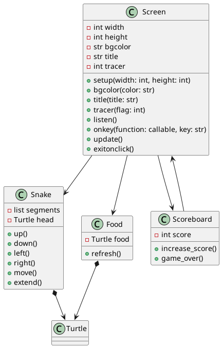
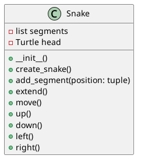
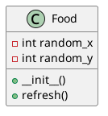
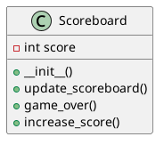
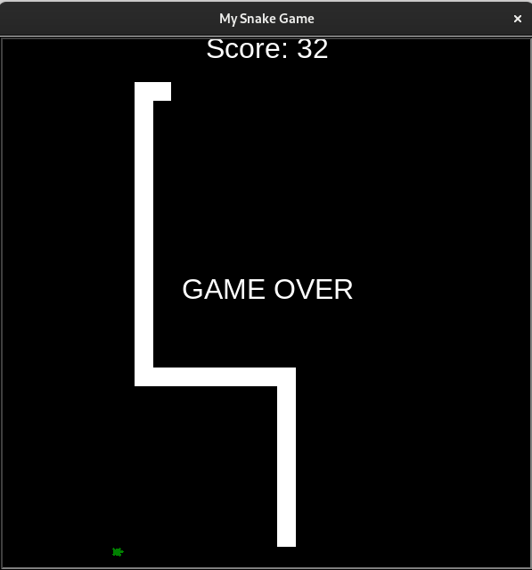
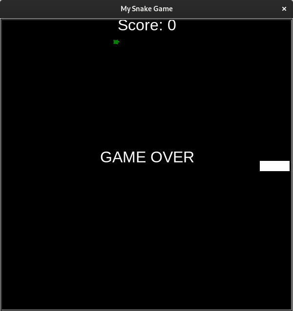

# Snake Game:

Re-create the classic arcade game using Python.

Users control the snake with the arrow keys. As the snake eats a green turtle, the snake will grow longer by one unit. Once a green turtle has been eaten by the snake, the green turtle will move to a random location on the screen. The snake cannot move in the direct opposite direction in which it is currently moving e.g., if the snake moving up, it cannot go downwards in the next movement command. If the snake collides with a part of its body or tail the game will be over. If a snake collides with a wall the game will be over. If the game is not yet over the user can continue eating turtles and grow longer, the score is updated with every eaten turtle and displayed on the top of the screen and the game will continue until a condition is met to end the game.

## I. Design Descisions:

### a. Obejct Orientated Design (OOP):
Encapsulation of related functionalities and data within classes e.g., Snake class, Food class and Scoreboard class.

### b. Modular Design:
Code is modularized into different files. (snake.py, food.py, scoreboard.py & main.py)

### c. Simple Design:
The program follows a simple and straightforward design, following SoC and OOP principles.

### d. Guided User Interface (GUI):
Use the Turtle module for creation of the GUI and game graphics.

## II. Design Principles:

### a. Modularity:
The code is modular, facilitating easy extension or modification of specific functionalities.

### b. Readability:
Meaningful naming, consistent indentation and concise comments contribute to code readability.

### c. Functions and Classes:
Utilizes names, consistent indentation, and concise comments contribute to code readability.

### III. Diagrams:

### Sequence Diagram:

### snake Class Diagram:

### food Class Diagram:

### scoreboard Class Diagram:

### IV. Gameplay Screenshots:

### Gameplay:
Here the user accumilated a score of 32 before losing the game.

### Game Over:
when the snake touches a wall or collides with it's own tail the game is over.

